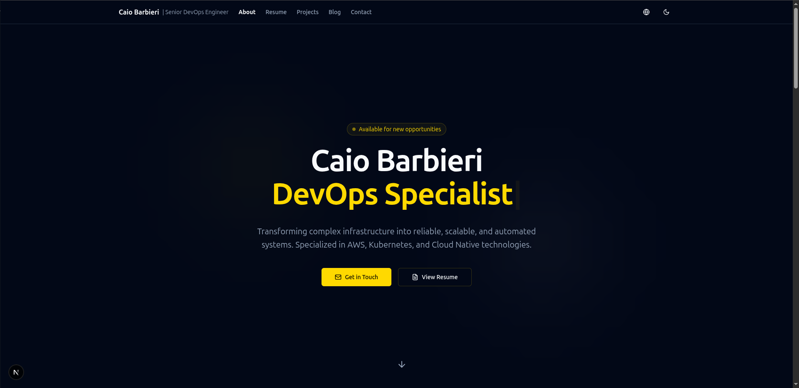

# 🚀 Modern Portfolio Template

A modern, responsive, and fully configurable portfolio template built with Next.js 16, TypeScript, and Tailwind CSS. Perfect for developers, designers, and professionals who want to showcase their work beautifully.



## ✨ Features

### 🎨 **Modern Design**
- Clean, professional interface with dark/light mode support
- Responsive design that works on all devices
- Beautiful animations and transitions
- Optimized for performance and accessibility

### 📝 **Content Management**
- **File-based CMS**: No complex setup, just edit JSON and Markdown files
- **Multilingual support**: English, Portuguese, and Spanish out of the box
- **Blog system**: Write posts in Markdown with full syntax highlighting
- **Project showcase**: Display your work with images, technologies, and links
- **Resume/CV**: Professional resume with PDF export capability

### 🔧 **Easy Configuration**
- **Single config file**: All site settings in one place (`config/site.json`)
- **Interactive setup**: Run `npm run setup` to configure everything
- **Template system**: Copy and customize for your own use
- **Comprehensive documentation**: Detailed setup guide

### 🚀 **Performance & SEO**
- **Next.js 16**: Latest features with App Router
- **Static generation**: Fast loading times
- **SEO optimized**: Meta tags, sitemaps, structured data
- **Image optimization**: Automatic image processing
- **Analytics ready**: Vercel Analytics integration
- **Social media previews**: Dynamic Open Graph images with profile photo

### 🛠 **Developer Experience**
- **TypeScript**: Full type safety
- **Tailwind CSS**: Utility-first styling
- **ESLint & Prettier**: Code quality tools
- **Vitest**: Testing framework
- **Hot reload**: Instant development feedback

## 🏁 Quick Start

### 1. Fork & Clone

Click **"Use this template"** or **"Fork"** on GitHub, then:

```bash
git clone https://github.com/YOUR_USERNAME/portfolio.git
cd portfolio
npm install
```

### 2. Run Interactive Setup

```bash
npm run setup
```

This will prompt you for your name, email, GitHub username, etc. and generate `config/site.json` and `content/profile/profile.json` automatically.

**Or configure manually:**

```bash
cp config/site.json.template config/site.json
cp content/profile/profile.json.template content/profile/profile.json
# Edit both files with your information
```

### 3. Add Your Content

```bash
# Add your work experience
content/experience/

# Add your projects
content/projects/

# Write blog posts (Markdown)
content/posts/

# Add your education
content/education/
```

See [CONFIG.md](CONFIG.md) for content file formats and examples.

### 4. Run Development Server

```bash
npm run dev
```

Open [http://localhost:3000](http://localhost:3000) to see your portfolio!

## 📋 After Forking Checklist

After forking or using this template, make sure to:

- [ ] Run `npm run setup` or manually create `config/site.json` from the template
- [ ] Update `content/profile/profile.json` with your bio
- [ ] Replace example content in `content/experience/`, `content/projects/`, `content/education/`
- [ ] Update `content/skills/skills.json` with your skills
- [ ] (Optional) Update `LICENSE` with your name
- [ ] (Optional) Add blog posts to `content/posts/`
- [ ] (Optional) Add your profile photo to `public/images/profile/`
- [ ] (Optional) Update resume files in `public/` (`resume.md`, `curriculo.md`)
- [ ] (Optional) Copy `.env.example` to `.env.local` and configure integrations

## 📁 Project Structure

```
portfolio/
├── app/                    # Next.js 16 App Router
│   ├── [lang]/            # Internationalization routes
│   ├── api/               # API routes
│   └── components/        # Page components
├── components/            # Reusable UI components
├── content/              # Your content (JSON/Markdown)
│   ├── posts/            # Blog posts (Markdown)
│   ├── projects/         # Portfolio projects (JSON)
│   ├── experience/       # Work experience (JSON)
│   ├── education/        # Education (JSON)
│   ├── skills/           # Skills list (JSON)
│   └── profile/          # Personal info (JSON)
├── config/               # Site configuration
│   ├── site.json         # Main config file
│   └── site.json.template # Template for new users
├── hooks/                # Custom React hooks
├── lib/                  # Utility functions
├── public/               # Static assets
└── types/                # TypeScript definitions
```

## ⚙️ Configuration

### Site Configuration (`config/site.json`)

The main configuration file controls all aspects of your portfolio:

```json
{
  "site": {
    "name": "Your Portfolio Name",
    "title": "Your Name - Your Profession",
    "shortName": "Your Name",
    "description": "Your professional description...",
    "url": "https://yourdomain.com",
    "author": "Your Full Name",
    "email": "your.email@example.com",
    "phone": "+1 (555) 123-4567",
    "location": "Your Location"
  },
  "social": {
    "github": "https://github.com/yourusername",
    "linkedin": "https://linkedin.com/in/yourprofile",
    "twitter": "https://twitter.com/yourusername",
    "website": "https://yourdomain.com"
  },
  "integrations": {
    "credlyUsername": "your-credly-username",
    "twitterHandle": "@yourusername"
  }
}
```

For detailed configuration instructions, see [CONFIG.md](CONFIG.md).

## 🎨 Customization

### Styling
- **Colors**: Edit `tailwind.config.ts`
- **Fonts**: Modify `app/layout.tsx`
- **Components**: Customize in `/components`

### Content
- **Blog posts**: Add Markdown files to `content/posts/`
- **Projects**: Add JSON files to `content/projects/`
- **Experience**: Add JSON files to `content/experience/`
- **Skills**: Edit `content/skills/skills.json`

### Images
- **Profile**: `/public/images/profile/`
- **Projects**: `/public/images/projects/`
- **Blog**: `/public/images/blog/`

## 🚀 Deployment

### Vercel (Recommended)

1. Push your code to GitHub
2. Connect your repository to Vercel
3. Deploy with zero configuration

### Other Platforms

The portfolio works on any platform that supports Next.js:
- Netlify
- Railway
- AWS Amplify
- Self-hosted

## 🌐 Internationalization

Built-in support for multiple languages:

- **English (en)**
- **Portuguese (pt)**
- **Spanish (es)**

Language switching via header controls, with automatic content fallbacks.

## 📊 Analytics & Monitoring

- **Vercel Analytics**: Built-in performance monitoring
- **Health endpoint**: `/api/health` for uptime monitoring
- **SEO optimization**: Automatic sitemaps and meta tags

## 🔌 Integrations

### Credly Certifications
Display your professional certifications automatically by setting your Credly username in the config.

### Social Links
Automatically generates social media links and contact information throughout the site.

## 🧪 Testing

```bash
# Run tests
npm test

# Run tests in watch mode
npm run test:watch
```

## 📦 Scripts

```bash
npm run setup        # Interactive setup wizard
npm run dev          # Start development server
npm run build        # Build for production
npm run start        # Start production server
npm run lint         # Run ESLint
npm run test         # Run tests
./scripts/build-resume.sh # Build PDF resumes (requires pdflatex or Docker)
```

## 🤝 Contributing

We welcome contributions! Whether you're fixing bugs, adding features, or improving documentation.

1. Fork the repository
2. Create a feature branch
3. Make your changes
4. Add tests if needed
5. Submit a pull request

## 📄 License

This project is open source and available under the [MIT License](LICENSE).

## 🆘 Support

Need help setting up your portfolio?

- 📖 Read the [Configuration Guide](CONFIG.md)
- 🐛 [Report issues](https://github.com/caiolombello/portfolio/issues)
- 💬 [Start a discussion](https://github.com/caiolombello/portfolio/discussions)

## 🌟 Showcase

Built with this template? We'd love to see your portfolio! Share it by opening an issue with the "showcase" label.

---

**Built with ❤️ for the developer community**

Give it a ⭐ if this template helped you build your portfolio!
